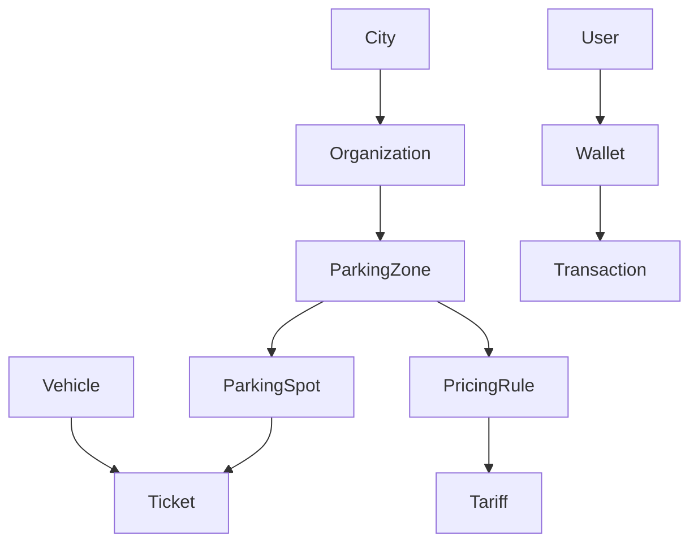
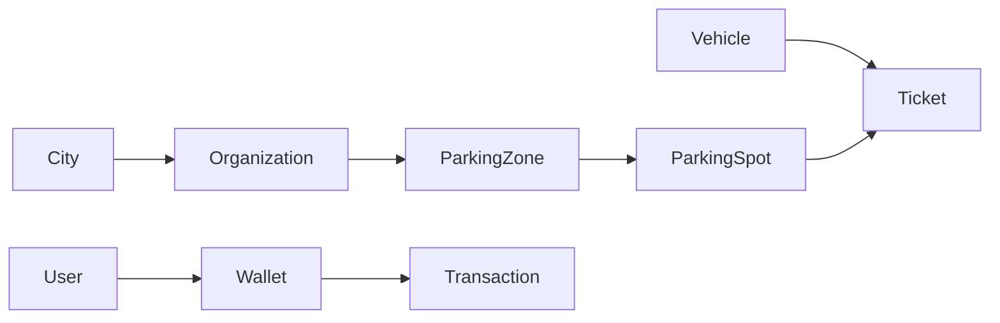

# Aggregates

## Overview

This document defines the Aggregate Roots of the Smart Parking Platform.

Aggregates establish transactional boundaries and encapsulate business consistency rules.

Only Aggregate Roots may be directly loaded from repositories.

Internal entities should always be modified through their Aggregate Root.

---

# Aggregate Map

This diagram represents business ownership, not database relationships.

---

# Aggregate: City

## Purpose

Represents a municipality served by the platform.

Cities organize organizations but do not manage parking operations directly.

---

## Responsibilities

- Maintain city identity.
- Group organizations.
- Define geographic scope.

---

## Invariants

- City name must be unique.
- A city may contain many organizations.
- A city cannot be deleted while organizations exist.

---

## Owns

- Organization (logical ownership)

---

# Aggregate: Organization

## Purpose

Represents the legal entity responsible for operating parking zones.

Organizations may represent:

- Government agencies
- Private companies

---

## Responsibilities

- Manage parking zones.
- Define employees.
- Configure operational policies.
- Configure pricing.

---

## Owns

- Parking Zones
- Organization Members

---

## Invariants

- Every organization belongs to one city.
- Every parking zone belongs to one organization.
- Employees cannot belong to deleted organizations.

---

# Aggregate: ParkingZone

## Purpose

Represents a physical parking area.

Examples:

- Street block
- Shopping parking
- Airport parking
- University parking

This is one of the central aggregates of the domain.

---

## Responsibilities

- Maintain parking spots.
- Maintain pricing configuration.
- Maintain geographic boundaries.
- Report availability.
- Accept reservations (future).

---

## Owns

- ParkingSpot
- PricingRule

---

## Invariants

- Every Parking Spot belongs to exactly one Parking Zone.
- Parking Spots cannot move between Parking Zones.
- Geometry must always exist.
- Display information must always exist.

---

## Availability

Availability is calculated by counting Parking Spots with status AVAILABLE.

The aggregate never stores availability as a persistent value.

---

## Capacity

Capacity is derived from the total number of Parking Spots.

It is never manually configured.

---

# Aggregate: Vehicle

## Purpose

Represents a vehicle capable of starting parking sessions.

Vehicles exist independently of users.

---

## Responsibilities

- Maintain vehicle identity.
- Maintain license plate.
- Associate optional owner.

---

## Invariants

- Plate is mandatory.
- Plate must be unique.
- Owner is optional.

---

# Aggregate: User

## Purpose

Represents an authenticated platform identity.

A User may act as:

- Customer
- Operator
- Organization Administrator

Permissions are determined by organization membership.

---

## Responsibilities

- Authentication.
- Authorization.
- Vehicle ownership.
- Optional Wallet.

---

## Owns

- Wallet (optional)

---

## Invariants

- Email must be unique.
- Username must be unique.
- Wallet is optional.

---

# Aggregate: Wallet

## Purpose

Represents a customer's financial account.

Wallets do not store balances directly.

Balance is derived from transactions.

---

## Responsibilities

- Register financial movements.
- Expose current balance.
- Maintain transaction history.

---

## Owns

- Transactions

---

## Invariants

- Every transaction is immutable.
- Balance is always calculated.
- Transactions cannot be deleted.

---

# Aggregate: Ticket

## Purpose

Represents a parking session.

A Ticket is independent from Parking Zones.

It references the Parking Spot used during the parking session.

---

## Responsibilities

- Maintain parking lifecycle.
- Associate Vehicle.
- Associate Parking Spot.
- Record timestamps.
- Store calculated price.

---

## References

- Vehicle
- ParkingSpot

---

## Invariants

- A Vehicle may have only one ACTIVE Ticket.
- A Parking Spot may have only one ACTIVE Ticket.
- Finished Tickets are immutable.
- Scheduled Tickets may be cancelled.
- Ticket prices are calculated externally.

---

# Aggregate Relationships

---

# Repository Boundaries

Repositories exist only for Aggregate Roots.

Current repositories:

- CityRepository
- OrganizationRepository
- ParkingZoneRepository
- VehicleRepository
- UserRepository
- WalletRepository
- TicketRepository

Repositories do NOT exist for:

- ParkingSpot
- PricingRule
- Tariff
- Transaction

These objects are managed exclusively through their parent Aggregate.

---

# Aggregate Communication

Aggregates should communicate through:

- Use Cases
- Domain Events

Aggregates must never directly modify each other's state.

Example:

Ticket Started

↓

Parking Spot becomes occupied

↓

Wallet receives debit transaction

Each operation occurs within its own business boundary.

---

# Aggregate Design Principles

The following principles must always be respected.

## Single Responsibility

Every Aggregate has one primary business responsibility.

---

## Encapsulation

Internal entities cannot be modified directly.

---

## Transactional Consistency

Business invariants must be guaranteed within Aggregate boundaries.

---

## Low Coupling

Aggregates communicate through identifiers and events instead of direct references whenever possible.

---

# Aggregate Summary

| Aggregate | Responsibility |
|------------|----------------|
| City | Organize organizations |
| Organization | Operate parking infrastructure |
| ParkingZone | Manage parking areas |
| Vehicle | Represent vehicles |
| User | Represent authenticated identities |
| Wallet | Manage customer balance |
| Ticket | Manage parking sessions |

---

# Final Notes

The Aggregate model described here represents the official transactional boundaries of the Smart Parking Platform.

Any modification affecting Aggregate ownership or responsibilities must be documented through an ADR before implementation.