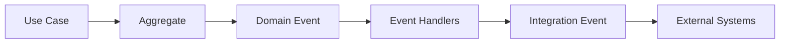

# Domain Events

## Overview

Domain Events represent business facts that have already occurred.

They are immutable and describe meaningful changes within the domain.

A Domain Event should answer the question:

> **"What happened?"**

Examples:

- A parking session started.
- A parking session finished.
- A parking spot became occupied.
- A wallet received credit.

Domain Events enable communication between Aggregates while keeping them loosely coupled.

---

# Event Categories

The Smart Parking Platform defines two event categories.

## Domain Events

Represent business events inside the domain.

Examples:

- TicketStarted
- TicketFinished
- ParkingSpotOccupied

---

## Integration Events

Represent events intended for external systems.

Examples:

- ParkingAvailabilityChanged
- PaymentRequested
- ReceiptGenerated

Integration Events are produced from Domain Events.

The Domain Model never publishes Integration Events directly.

---

# Event Flow



---

# TicketStarted

## Description

Occurs when a new parking session begins.

---

## Trigger

A Ticket changes from:

NONE

↓

ACTIVE

---

## Payload

- TicketId
- VehicleId
- ParkingSpotId
- ParkingZoneId
- StartedAt

---

## Possible Consumers

ParkingSpot

Analytics

Audit Log

Notifications (Future)

---

# TicketFinished

## Description

Occurs when a parking session ends.

---

## Trigger

ACTIVE

↓

FINISHED

---

## Payload

- TicketId
- FinishedAt
- Duration
- FinalPrice

---

## Possible Consumers

Pricing

Wallet

Receipt

Analytics

---

# ParkingSpotOccupied

## Description

A Parking Spot changed from AVAILABLE to OCCUPIED.

---

## Trigger

AVAILABLE

↓

OCCUPIED

---

## Payload

- ParkingSpotId
- ParkingZoneId

---

## Possible Consumers

AvailabilityService

Analytics

Maps API (Future)

---

# ParkingSpotReleased

## Description

A Parking Spot became available again.

---

## Trigger

OCCUPIED

↓

AVAILABLE

---

## Payload

- ParkingSpotId
- ParkingZoneId

---

## Consumers

AvailabilityService

Maps API

Analytics

---

# ParkingSpotReserved

## Description

A reservation successfully locked a Parking Spot.

---

## Trigger

Reservation created.

---

## Payload

- ParkingSpotId
- TicketId

---

# WalletCredited

## Description

Credit was added to a customer's wallet.

---

## Payload

- WalletId
- TransactionId
- Amount

---

## Consumers

Audit

Analytics

Notifications

---

# WalletDebited

## Description

Funds were deducted from a wallet.

---

## Trigger

Successful parking payment.

---

## Payload

- WalletId
- TransactionId
- Amount

---

## Consumers

Receipt

Analytics

Audit

---

# PricingCalculated

## Description

Represents the successful calculation of a parking price.

This event does not imply payment.

---

## Payload

- TicketId
- PricingRuleId
- Strategy
- Amount

---

## Consumers

Ticket

Receipt

Analytics

---

# Integration Events

The following events are intended for systems outside the domain.

---

## ParkingAvailabilityChanged

Purpose:

Update maps and client applications.

Possible consumers:

- WebSocket Gateway
- Mobile App
- Maps Integration

---

## ParkingSessionStarted

Purpose:

Notify external systems that a parking session has begun.

Possible consumers:

- Smart City Platform
- AI Services
- Fleet Systems

---

## ParkingSessionFinished

Purpose:

Notify external systems that a parking session has ended.

---

## ReceiptGenerated

Purpose:

Deliver proof of payment.

---

## PaymentRequested

Purpose:

Request payment from external payment providers.

Examples:

- Stripe
- Mercado Pago
- Adyen

---

# Event Design Principles

Events are immutable.

Events describe facts.

Events are named using the past tense.

Examples:

✔ TicketStarted

✔ WalletCredited

✔ ParkingSpotReleased

Avoid imperative names.

✘ StartTicket

✘ UpdateParkingSpot

✘ ChargeWallet

---

# Event Chaining

A single business action may generate multiple events.

Example:

```text
Customer starts parking

↓

TicketStarted

↓

ParkingSpotOccupied

↓

PricingInitialized

↓

ParkingAvailabilityChanged
```

Likewise:

```text
Customer finishes parking

↓

TicketFinished

↓

PricingCalculated

↓

WalletDebited

↓

ParkingSpotReleased

↓

ParkingAvailabilityChanged

↓

ReceiptGenerated
```

---

# Domain Event Rules

- Events never modify Aggregates directly.
- Events are immutable.
- Events should be idempotent whenever possible.
- Events should contain only business data.
- Events should never expose infrastructure concerns.

---

# Future Events

The architecture supports new events without changing existing Aggregates.

Examples:

- SensorConnected
- SensorDisconnected
- VehicleRecognized
- DynamicPricingActivated
- ReservationExpired
- ReservationCancelled
- ParkingZoneClosed
- ParkingZoneOpened

---

# Summary

Domain Events provide loose coupling between Aggregates while preserving business consistency.

Integration Events expose important business facts to systems outside the domain without introducing infrastructure dependencies into the core domain.