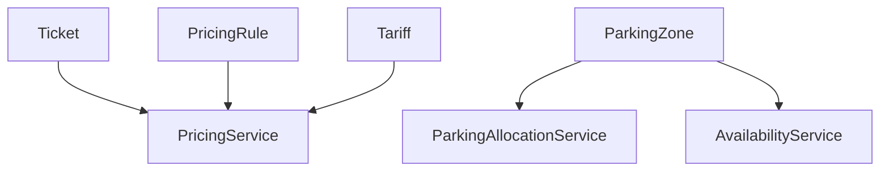

# Domain Services

## Overview

Domain Services encapsulate business logic that does not naturally belong to a single Entity or Aggregate.

Unlike Application Services, Domain Services contain pure business rules and are independent of infrastructure concerns.

Domain Services:

- Do not access HTTP.
- Do not know about databases.
- Do not depend on NestJS.
- Do not perform authentication.

Their only responsibility is to execute domain logic.

---

# Current Domain Services

The Smart Parking Platform currently defines four Domain Services.

- PricingService
- ParkingAllocationService
- AvailabilityService
- ReservationPolicyService (Future)

---

# PricingService

## Purpose

PricingService is responsible for calculating the cost of a parking session.

Pricing behavior is intentionally isolated from the Ticket entity to allow pricing strategies to evolve independently.

---

## Responsibilities

PricingService is responsible for:

- Selecting the applicable Pricing Rule.
- Selecting the applicable Tariff.
- Applying pricing policies.
- Returning the final parking cost.

---

## Inputs

- ParkingZone
- Ticket
- Entry Time
- Exit Time

---

## Output

Money

---

## Business Rules

PricingService must support:

- Hourly pricing
- Daily pricing
- Weekend pricing
- Night pricing
- Holiday pricing
- Promotional pricing (future)

without modifying the Ticket entity.

---

## Ticket Responsibility

Ticket never calculates prices.

Instead:

Ticket

↓

PricingService

↓

Calculated Amount

---

# ParkingAllocationService

## Purpose

Responsible for selecting the Parking Spot assigned to a new Ticket.

The allocation strategy may change without modifying Ticket or ParkingSpot.

---

## Responsibilities

- Find available Parking Spots.
- Apply allocation strategy.
- Return selected Parking Spot.

---

## Possible Strategies

Current strategy:

Nearest Available Spot

Future strategies:

- Random
- Least Used
- Reserved Area
- Accessible Parking Priority
- Electric Vehicle Priority

---

## Example

Customer starts parking.

↓

ParkingAllocationService searches available spots.

↓

Closest available spot is returned.

↓

Ticket is created.

---

# AvailabilityService

## Purpose

Calculates parking availability inside a Parking Zone.

Availability is always derived.

It is never stored.

---

## Responsibilities

- Count available Parking Spots.
- Count occupied Parking Spots.
- Count reserved Parking Spots.
- Report occupancy rate.

---

## Example

Parking Zone

↓

150 Parking Spots

↓

120 Occupied

↓

30 Available

Availability = 30

Occupancy = 80%

---

# ReservationPolicyService (Future)

## Purpose

Determines whether reservations are allowed.

Current business rules:

Public Parking

↓

Reservations are NOT allowed.

Private Parking

↓

Reservations MAY be allowed.

---

Future versions may include:

- Reservation windows
- Deposit requirements
- Reservation expiration
- Cancellation policies

---

# Why Domain Services?

Business behavior should belong to the Domain.

Example:

BAD

Ticket.calculatePrice()

GOOD

PricingService.calculate(ticket)

---

BAD

ParkingZone.findNearestSpot()

GOOD

ParkingAllocationService.allocate()

---

BAD

Wallet.calculateBalance()

GOOD

Wallet.balance()

(Balance is derived internally from Transactions.)

---

# Service Relationships

---

# Domain Service Principles

A Domain Service should:

- Represent business behavior.
- Be stateless.
- Receive entities as input.
- Return business results.

A Domain Service should never:

- Persist entities.
- Access repositories directly.
- Perform HTTP requests.
- Access external APIs.
- Send notifications.
- Authenticate users.

---

# Future Domain Services

The current architecture allows new Domain Services to be added without changing existing Aggregates.

Possible future services include:

- DynamicPricingService
- SensorValidationService
- ParkingRecommendationService
- FraudDetectionService
- RouteOptimizationService
- OccupancyPredictionService

---

# Summary

| Service | Responsibility |
|----------|----------------|
| PricingService | Calculate parking prices |
| ParkingAllocationService | Allocate parking spots |
| AvailabilityService | Calculate parking availability |
| ReservationPolicyService | Validate reservation policies |

These services encapsulate business behavior shared across multiple Aggregates while preserving the responsibilities of each entity.