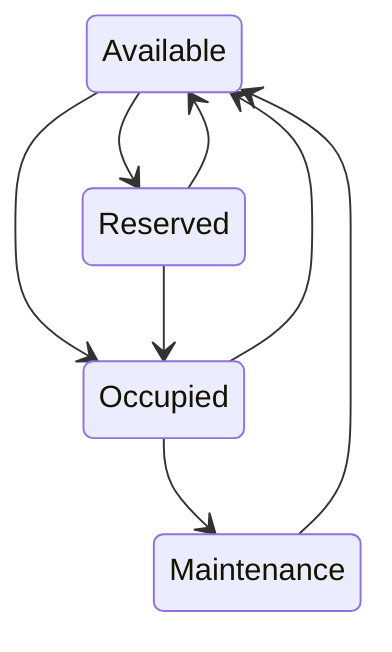
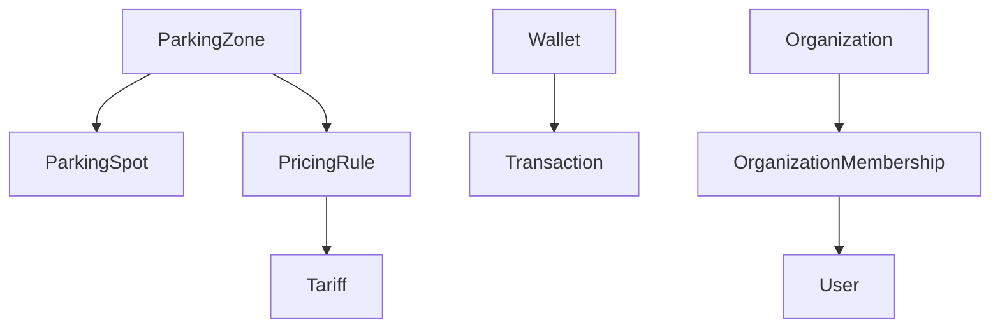

# Entities

## Overview

Entities are domain objects with identity.

Unlike Value Objects, entities maintain their identity throughout their lifecycle, even if some of their attributes change.

Entities that are not Aggregate Roots are always managed through their parent Aggregate.

---

# ParkingSpot

## Purpose

Represents a single parking position inside a Parking Zone.

A Parking Spot may represent:

- A numbered street parking space
- A shopping mall parking space
- A garage parking space
- A parking space monitored by sensors
- A parking space identified by a QR Code

Parking Spots never exist outside a Parking Zone.

---

## Identity

```text
ParkingSpotId
```

---

## Attributes

| Attribute | Description |
|------------|-------------|
| id | Unique identifier |
| parkingZoneId | Parent Parking Zone |
| identifier | Human-readable identifier (e.g. A-15, 001) |
| geometry | Optional Point geometry |
| qrCode | Optional QR Code |
| sensorId | Optional IoT sensor identifier |
| status | Current parking spot status |

---

## Responsibilities

A Parking Spot is responsible for:

- Knowing whether it is available.
- Knowing whether it is occupied.
- Knowing whether it is reserved.
- Knowing whether it is under maintenance.
- Changing its own status.

---

## It is NOT responsible for

- Creating Tickets.
- Calculating prices.
- Charging customers.
- Finding nearby parking.
- Reserving itself.

---

## Status Lifecycle



---

## Status Values

| Status | Description |
|---------|-------------|
| AVAILABLE | Ready to receive vehicles |
| OCCUPIED | Vehicle currently parked |
| RESERVED | Reserved for future usage |
| MAINTENANCE | Temporarily unavailable |

---

# PricingRule

## Purpose

Defines how parking prices should be calculated.

Pricing rules are configuration objects interpreted by the PricingService.

PricingRule never performs calculations.

---

## Identity

```text
PricingRuleId
```

---

## Responsibilities

- Define calculation strategy.
- Define validity period.
- Define pricing priority.
- Reference tariff configuration.

---

## Example

Hourly Pricing

Daily Pricing

Weekend Pricing

Night Pricing

Holiday Pricing

---

## It is NOT responsible for

- Calculating prices.
- Charging users.
- Validating Tickets.

---

# Tariff

## Purpose

Represents configurable monetary values used by Pricing Rules.

Tariffs allow pricing values to change without modifying business logic.

---

## Responsibilities

- Store monetary values.
- Store pricing intervals.
- Store validity periods.

---

## Example

08:00 - 18:00

R$ 8/hour

18:00 - 08:00

R$ 5/hour

---

## It is NOT responsible for

- Choosing which tariff applies.
- Calculating parking prices.

---

# Transaction

## Purpose

Represents a financial movement within a Wallet.

Transactions are immutable.

A Transaction never changes after being created.

---

## Identity

```text
TransactionId
```

---

## Transaction Types

| Type |
|------|
| CREDIT |
| DEBIT |
| REFUND |

---

## Responsibilities

- Record monetary movement.
- Record timestamp.
- Record origin.
- Record amount.

---

## It is NOT responsible for

- Calculating wallet balance.
- Charging parking.
- Performing refunds automatically.

---

# OrganizationMembership

## Purpose

Represents the relationship between a User and an Organization.

Membership defines permissions inside an organization.

---

## Identity

Composite

OrganizationId + UserId

---

## Roles

| Role |
|------|
| ADMIN |
| OPERATOR |

Future roles may include:

- SUPERVISOR
- AUDITOR
- FINANCE

---

## Responsibilities

- Define organization permissions.
- Associate users with organizations.

---

# Entity Relationships



---

# Entity Lifecycle

Entities exist only while their Aggregate exists.

Example:

Deleting a Parking Zone removes:

- Parking Spots
- Pricing Rules

Deleting a Wallet is not allowed.

Transactions remain immutable forever.

---

# Design Principles

Entities should:

- Own their own state.
- Protect business invariants.
- Expose business behavior instead of setters.
- Avoid anemic models.

Entities should never:

- Access repositories.
- Perform database operations.
- Call external services.
- Execute HTTP requests.
- Depend on infrastructure.

---

# Summary

| Entity | Parent Aggregate |
|----------|-----------------|
| ParkingSpot | ParkingZone |
| PricingRule | ParkingZone |
| Tariff | PricingRule |
| Transaction | Wallet |
| OrganizationMembership | Organization |

These entities encapsulate business behavior while remaining entirely dependent on their Aggregate Roots.